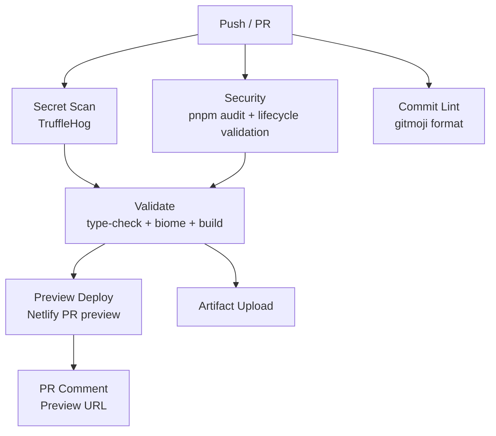

# Quality Assurance Manual — rc-portfolio-2

> **English version** for GitHub accessibility. This manual defines the quality standards, validation gates, and best practices for the rc-portfolio-2 project, adapted from the enterprise-grade SGS_WEB pipeline.

---

## Table of Contents

1. [Overview & Quality Philosophy](#1-overview--quality-philosophy)
2. [Technology Stack & Tooling](#2-technology-stack--tooling)
3. [Code Formatting & Linting (Biome + Prettier)](#3-code-formatting--linting-biome--prettier)
4. [Type Safety & TypeScript Validation](#4-type-safety--typescript-validation)
5. [Git Hooks (Husky + lint-staged)](#5-git-hooks-husky--lint-staged)
6. [Commit Convention (Gitmoji)](#6-commit-convention-gitmoji)
7. [Branching Strategy & PR Workflow](#7-branching-strategy--pr-workflow)
8. [CI/CD Pipeline](#8-cicd-pipeline)
9. [Secret Scanning & Supply Chain Security](#9-secret-scanning--supply-chain-security)
10. [Accessibility (WCAG 2.1 AA)](#10-accessibility-wcag-21-aa)
11. [Performance & Lighthouse](#11-performance--lighthouse)
12. [SonarQube / Static Analysis](#12-sonarqube--static-analysis)
13. [Dead Code Detection (knip)](#13-dead-code-detection-knip)
14. [Release & Tag Management](#14-release--tag-management)
15. [PR Auto-Triage & Labeling](#15-pr-auto-triage--labeling)
16. [Internationalization (i18n) Quality](#16-internationalization-i18n-quality)
17. [Quality Checklist for Every PR](#17-quality-checklist-for-every-pr)
18. [Comparison: SGS_WEB vs rc-portfolio-2](#18-comparison-sgs_web-vs-rc-portfolio-2)
19. [Reference Files](#19-reference-files)

---

## 1. Overview & Quality Philosophy

This project adopts an **enterprise-grade quality pipeline** inspired by SGS_WEB (Consir Sistemas), adapted for a personal portfolio with React + TypeScript + Vite.

### Core Principles

| Principle | Implementation |
|---|---|
| **Shift-left testing** | Hooks validate locally before push; CI catches what hooks miss |
| **Zero-tolerance for secrets** | TruffleHog in CI + pre-commit package.json lifecycle validation |
| **Automated formatting** | Biome handles 100% of code style — no human discussions about formatting |
| **Type safety first** | `tsc --noEmit` is a hard gate, not a suggestion |
| **Accessibility by design** | WCAG 2.1 AA enforced in code review; keyboard focus-visible mandatory |
| **Defense in depth** | Pre-commit hook → Pre-push hook → CI → Preview deploy → Production deploy |
| **Internationalization completeness** | All user-facing strings translated across all 20 supported languages |

### Quality Gate Pipeline

```
Developer writes code
        │
        ▼
┌─────────────────────┐
│  Pre-commit (Husky)  │  ← Security scan + lint-staged (Biome)
└────────┬────────────┘
         │ passes
         ▼
┌─────────────────────┐
│  Pre-push (Husky)    │  ← type-check + biome + build (Turbo if monorepo)
└────────┬────────────┘
         │ passes
         ▼
┌─────────────────────┐
│  GitHub CI           │  ← Secret scan + Security audit + Validate + Commit lint
└────────┬────────────┘
         │ passes
         ▼
┌─────────────────────┐
│  Preview Deploy      │  ← Netlify PR preview (auto-commented on PR)
└────────┬────────────┘
         │ reviewed & merged
         ▼
┌─────────────────────┐
│  Production Deploy   │  ← Netlify production (main branch only)
└─────────────────────┘
```

---

## 2. Technology Stack & Tooling

| Tool | Version | Purpose |
|---|---|---|
| **React** | 19.x | UI framework |
| **TypeScript** | ~5.8 | Type safety |
| **Vite** | 6.x | Build tool & dev server |
| **TailwindCSS** | 3.4 | Styling |
| **Biome** | 2.4+ | Linter + formatter (replaces ESLint) |
| **Prettier** | 3.8+ | Code formatter (runs alongside Biome for non-JS files) |
| **pnpm** | (preferred) | Package manager |
| **Husky** | 9.x | Git hooks |
| **lint-staged** | 17.x | Run linters on staged files only |
| **knip** | (recommended) | Dead code/dependency detection |
| **SonarQube** | Community | Static analysis & code quality dashboard |
| **TruffleHog** | latest | Secret scanning in CI |
| **GitHub Actions** | — | CI/CD orchestration |

---

## 3. Code Formatting & Linting (Biome + Prettier)

### Biome Configuration

Biome is the **primary linter and formatter** for TypeScript/JavaScript files. It replaces ESLint entirely with faster, zero-config execution.

**File:** `biome.json`

```jsonc
{
  "$schema": "https://biomejs.dev/schemas/2.4.4/schema.json",
  "vcs": {
    "enabled": true,
    "clientKind": "git",
    "useIgnoreFile": true
  },
  "files": {
    "ignoreUnknown": true,
    "includes": [
      "**",
      "!**/node_modules",
      "!**/dist",
      "!**/coverage",
      "!**/*.d.ts",
      "!**/.github/"
    ]
  },
  "formatter": {
    "enabled": true,
    "formatWithErrors": false,
    "indentStyle": "space",
    "indentWidth": 2,
    "lineEnding": "lf",
    "lineWidth": 100
  },
  "linter": {
    "enabled": true,
    "includes": ["**/*.ts", "**/*.tsx", "**/*.js", "**/*.jsx"],
    "rules": {
      "recommended": true,
      "correctness": {
        "noUnusedImports": "error",
        "noUnusedVariables": {
          "level": "error",
          "options": { "ignoreRestSiblings": true }
        },
        "useParseIntRadix": "error"
      },
      "style": {
        "useConst": "warn",
        "useTemplate": "warn",
        "noNonNullAssertion": "warn",
        "useImportType": "warn",
        "useFilenamingConvention": {
          "level": "error",
          "options": {
            "filenameCases": ["PascalCase", "kebab-case"]
          }
        }
      },
      "suspicious": {
        "noExplicitAny": "error",
        "noArrayIndexKey": "warn",
        "noImplicitAnyLet": "error"
      }
    }
  },
  "javascript": {
    "formatter": {
      "quoteStyle": "single",
      "semicolons": "asNeeded",
      "trailingCommas": "all",
      "arrowParentheses": "asNeeded",
      "operatorLinebreak": "before",
      "lineEnding": "lf"
    }
  }
}
```

### Prettier Configuration

Prettier handles file types Biome doesn't cover well (JSON, CSS, Markdown).

**File:** `.prettierrc`

```json
{
  "plugins": [],
  "tabWidth": 2,
  "semi": false,
  "singleQuote": true,
  "useTabs": false,
  "endOfLine": "lf"
}
```

### Commands

```bash
pnpm lint          # Biome check (read-only)
pnpm lint:fix      # Biome check + auto-fix
pnpm format        # Prettier write (JSON, CSS, MD)
pnpm format:check  # Prettier check (CI mode)
pnpm fix           # Full fix pipeline: prettier + biome:fix + build + type-check
```

### Key Rules Enforced

| Rule | Level | Why |
|---|---|---|
| `noExplicitAny` | **error** | Forces proper typing; prevents silent type erasure |
| `noUnusedImports` | **error** | Dead imports = dead code |
| `noUnusedVariables` | **error** | Catch incomplete refactors |
| `useFilenamingConvention` | **error** | Consistent file naming (PascalCase for components) |
| `useImportType` | warn | `import type` ensures type-only imports are erased at build |
| `noNonNullAssertion` | warn | `!` operator bypasses null safety |

---

## 4. Type Safety & TypeScript Validation

### Hard Gate

TypeScript checking is **non-negotiable**. The build command includes `tsc` as a prerequisite:

```json
{
  "build": "tsc && vite build && node scripts/copy-sw.js"
}
```

### tsconfig Best Practices

```jsonc
{
  "compilerOptions": {
    "target": "ES2020",
    "useDefineForClassFields": true,
    "lib": ["ES2020", "DOM", "DOM.Iterable"],
    "module": "ESNext",
    "skipLibCheck": true,
    "moduleResolution": "bundler",
    "allowImportingTsExtensions": true,
    "isolatedModules": true,
    "moduleDetection": "force",
    "noEmit": true,
    "jsx": "react-jsx",
    "strict": true,
    "noUnusedLocals": true,
    "noUnusedParameters": true,
    "noFallthroughCasesInSwitch": true,
    "forceConsistentCasingInFileNames": true
  }
}
```

### Validation Command

```bash
npx tsc --noEmit   # Type check without producing output
```

This must produce **zero errors** before any commit or push.

---

## 5. Git Hooks (Husky + lint-staged)

### Pre-commit Hook

Runs on every `git commit`. Validates staged files only.

**Checks performed:**
1. **Merge conflict markers** — blocks commits with unresolved `<<<<<<< ======= >>>>>>>`
2. **Package.json lifecycle validation** — blocks `preinstall`/`postinstall` scripts that execute arbitrary code (supply-chain attack prevention)
3. **lint-staged** — Biome format + lint on staged files only
4. **Security quick scan** — detects invisible Unicode characters (steganography/homoglyph attacks)

**Setup:**

```bash
pnpm add -D husky lint-staged
npx husky init
```

**`.husky/pre-commit`:**

```sh
#!/usr/bin/env sh
set -eu

# 1. Merge conflict markers
staged=$(git diff --cached --name-only --diff-filter=ACM -- '*.ts' '*.tsx' '*.js' '*.json')
if [ -n "$staged" ]; then
  echo "$staged" | while IFS= read -r f; do
    if grep -qP '^(<<<<<<<|=======|>>>>>>>)' "$f" 2>/dev/null; then
      echo "ERROR: Unresolved merge conflict in $f"
      exit 1
    fi
  done
fi

# 2. lint-staged (Biome on staged files)
npx lint-staged
```

**`lint-staged` config in `package.json`:**

```json
{
  "lint-staged": {
    "*.{ts,tsx,js,jsx}": [
      "biome check --write --no-errors-on-unmatched"
    ],
    "*.{json,css,md}": [
      "biome check --write --no-errors-on-unmatched"
    ]
  }
}
```

### Pre-push Hook

Runs the full local validation pipeline before allowing a push.

**`.husky/pre-push`:**

```sh
#!/usr/bin/env sh
echo "\033[1;36m[husky] pre-push: type-check + biome + build...\033[0m"

npx tsc --noEmit && npx biome check . && npm run build

if [ $? -ne 0 ]; then
  echo "\033[1;31m[ERROR] Pipeline failed! Fix errors before push.\033[0m"
  exit 1
fi

echo "\033[1;32m[OK] Pipeline passed\033[0m"
```

---

## 6. Commit Convention (Gitmoji)

### Format

```
:emoji: type(scope): description
```

**Rules:**
1. **Emoji first** — always starts with a gitmoji code (e.g., `:sparkles:`)
2. **type** — conventional commit type (`feat`, `fix`, `refactor`, `docs`, `chore`, `perf`, `style`, `test`, `ci`)
3. **scope** — area of change (`hero`, `skills`, `cta`, `nav`, `i18n`, `config`, `ci`)
4. **description** — imperative mood, English, concise

### Common Emojis

| Emoji | Code | Use |
|---|---|---|
| ✨ | `:sparkles:` | New feature |
| 🐛 | `:bug:` | Bug fix |
| ♻️ | `:recycle:` | Refactor |
| 🎨 | `:art:` | Improve structure/format |
| ⚡ | `:zap:` | Performance improvement |
| 📝 | `:memo:` | Documentation |
| 🔒 | `:lock:` | Security fix |
| ♿ | `:wheelchair:` | Accessibility |
| 🌐 | `:globe_with_meridians:` | i18n / l10n |
| 🔧 | `:wrench:` | Configuration |
| 📦 | `:package:` | Build / dependencies |
| 🔖 | `:bookmark:` | Release / version tag |
| 🚨 | `:rotating_light:` | Linter/compiler fixes |
| 🔍 | `:mag:` | SEO improvement |

### CI Commit Validation (from SGS_WEB pattern)

SGS_WEB enforces commit format via CI with a regex pattern. To replicate:

```yaml
- name: Validate commit messages
  shell: bash
  run: |
    BASE_SHA="${{ github.event.pull_request.base.sha }}"
    HEAD_SHA="${{ github.event.pull_request.head.sha }}"
    PATTERN="^:[a-z_]+:\s[a-z]+([a-z-]*)?(\([a-zA-Z0-9/_.-]+\)): .+"

    FAILED=0
    for COMMIT in $(git rev-list "$BASE_SHA..$HEAD_SHA"); do
      MSG=$(git log -1 --format="%s" "$COMMIT")
      PARENTS=$(git rev-list --parents -1 "$COMMIT" | wc -w)
      if [ "$PARENTS" -gt 2 ]; then
        echo "  Skipping merge commit: $MSG"
        continue
      fi
      if ! echo "$MSG" | grep -qE "$PATTERN"; then
        echo "  Invalid commit: $MSG"
        FAILED=1
      fi
    done

    [ "$FAILED" -eq 0 ] && echo "All commits valid!" || exit 1
```

### Examples

```
:sparkles: feat(skills): add Skills section with 16 tech badges
:bug: fix(hero): correct focus-visible ring on social links
:recycle: refactor(env): centralize githubReposUrl in env.ts
:wheelchair: fix(a11y): revert decorative hero image alt to empty
:globe_with_meridians: feat(i18n): add skills translations for 20 languages
:lock: security(cta): replace direct import.meta.env with env.contactEmail
```

---

## 7. Branching Strategy & PR Workflow

### Branch Model

```
main (production)
  │
  ├── develop (integration)
  │     │
  │     ├── feat/20_portfolio-improvements
  │     ├── fix/15-remove-gsap-animations
  │     └── perf/optimize-performance
  │
  └── [hotfix branches → main directly]
```

### Rules

| Rule | Enforcement |
|---|---|
| PRs target `develop`, never `main` directly | CI `validate-pr-base` job |
| `main` accepts PRs only from `develop` | CI gate |
| Branch naming: `feat/ISSUE-description`, `fix/ISSUE-description`, `perf/ISSUE-description` | Convention |
| No force push to protected branches | GitHub branch protection |
| Squash merges preferred | Cleaner history |

### PR Template Checklist

Every PR must include:

```markdown
## Description
[What changed and why]

## Type of Change
- [ ] Bug fix
- [ ] Feature
- [ ] Refactor
- [ ] Documentation
- [ ] Chore
- [ ] Performance
- [ ] Accessibility

## Related Issue
Closes #XX

## Verification
- [ ] TypeScript: `tsc --noEmit` passes
- [ ] Biome: `biome check src/` passes with 0 new errors
- [ ] Build: `vite build` succeeds
- [ ] Manual review performed
- [ ] No new console warnings
- [ ] Accessibility checked (keyboard nav, screen reader)
- [ ] All translations updated (if i18n changes)

## Files Changed
- N files, +X/-Y lines
```

---

## 8. CI/CD Pipeline

### Architecture (adapted from SGS_WEB)

The CI pipeline runs **6 parallel/sequential jobs**:



### CI Workflow (`.github/workflows/ci.yml`)

```yaml
name: CI

on:
  push:
    branches: [main, develop]
  pull_request:
    branches: [main, develop]

concurrency:
  group: ${{ github.workflow }}-${{ github.ref }}
  cancel-in-progress: true

jobs:
  # ──────────────────────────────────────────────
  # 1. Secret scan (parallel)
  # ──────────────────────────────────────────────
  secret-scan:
    name: Secret Scan
    runs-on: ubuntu-latest
    steps:
      - uses: actions/checkout@v4
        with:
          fetch-depth: 0
      - name: Run TruffleHog
        uses: trufflesecurity/trufflehog@main
        with:
          path: ./
          base: ${{ github.event.repository.default_branch }}
          head: HEAD

  # ──────────────────────────────────────────────
  # 2. Security audit (parallel)
  # ──────────────────────────────────────────────
  security:
    name: Security Audit
    runs-on: ubuntu-latest
    steps:
      - uses: actions/checkout@v4
      - uses: pnpm/action-setup@v4
      - uses: actions/setup-node@v4
        with:
          node-version: 22
          cache: pnpm
      - run: pnpm install --frozen-lockfile
      - run: pnpm audit --audit-level high
        continue-on-error: true

  # ──────────────────────────────────────────────
  # 3. Validate: type-check + biome + build
  # ──────────────────────────────────────────────
  validate:
    name: Validate
    runs-on: ubuntu-latest
    needs: [secret-scan, security]
    steps:
      - uses: actions/checkout@v4
      - uses: pnpm/action-setup@v4
      - uses: actions/setup-node@v4
        with:
          node-version: 22
          cache: pnpm
      - run: pnpm install --frozen-lockfile

      - name: Type check
        run: npx tsc --noEmit

      - name: Lint
        run: npx biome check src/

      - name: Build
        run: pnpm run build

      - name: Upload artifacts
        uses: actions/upload-artifact@v4
        with:
          name: dist
          path: dist/
          retention-days: 7

  # ──────────────────────────────────────────────
  # 4. Commit message lint (PR only)
  # ──────────────────────────────────────────────
  commit-lint:
    name: Commit Lint
    runs-on: ubuntu-latest
    needs: [secret-scan, security]
    if: github.event_name == 'pull_request'
    steps:
      - uses: actions/checkout@v4
        with:
          fetch-depth: 0
      - name: Validate gitmoji format
        shell: bash
        run: |
          BASE_SHA="${{ github.event.pull_request.base.sha }}"
          HEAD_SHA="${{ github.event.pull_request.head.sha }}"
          PATTERN="^:[a-z_]+:\s[a-z]+([a-z-]*)?(\([a-zA-Z0-9/_.-]+\)): .+"
          FAILED=0
          for COMMIT in $(git rev-list "$BASE_SHA..$HEAD_SHA"); do
            MSG=$(git log -1 --format="%s" "$COMMIT")
            PARENTS=$(git rev-list --parents -1 "$COMMIT" | wc -w)
            if [ "$PARENTS" -gt 2 ]; then continue; fi
            if ! echo "$MSG" | grep -qE "$PATTERN"; then
              echo "  Invalid: $MSG"
              FAILED=1
            fi
          done
          [ "$FAILED" -eq 0 ] && echo "All commits valid!" || exit 1

  # ──────────────────────────────────────────────
  # 5. PR base validation
  # ──────────────────────────────────────────────
  validate-pr-base:
    name: Validate PR Base
    runs-on: ubuntu-latest
    if: github.event_name == 'pull_request'
    steps:
      - run: |
          BASE="${{ github.base_ref }}"
          HEAD="${{ github.head_ref }}"
          if [ "$BASE" = "main" ] && [ "$HEAD" != "develop" ]; then
            echo "PRs to main are only allowed from develop."
            exit 1
          fi

  # ──────────────────────────────────────────────
  # 6. Preview deploy (PR only)
  # ──────────────────────────────────────────────
  preview:
    name: Preview Deploy
    runs-on: ubuntu-latest
    needs: [validate]
    if: github.event_name == 'pull_request' && needs.validate.result == 'success'
    permissions:
      pull-requests: write
    steps:
      - uses: actions/download-artifact@v4
        with:
          name: dist
          path: dist/
      - name: Deploy to Netlify
        env:
          NETLIFY_AUTH_TOKEN: ${{ secrets.NETLIFY_AUTH_TOKEN }}
          NETLIFY_SITE_ID: ${{ secrets.NETLIFY_SITE_ID }}
        run: |
          npx netlify-cli deploy \
            --alias="pr-${{ github.event.pull_request.number }}" \
            --dir=dist \
            --json > /tmp/deploy.json 2>&1 || exit 1
          URL=$(jq -r '.deploy_url // .url' /tmp/deploy.json)
          echo "preview_url=$URL" >> $GITHUB_OUTPUT
      - name: Comment on PR
        uses: actions/github-script@v7
        env:
          PREVIEW_URL: ${{ steps.deploy.outputs.preview_url }}
        with:
          script: |
            const pr = context.payload.pull_request.number;
            const url = process.env.PREVIEW_URL;
            const marker = '<!-- netlify-preview -->';
            const body = `${marker}\n## Preview Deploy\n\n**URL:** [${url}](${url})\n`;
            const comments = await github.rest.issues.listComments({
              owner: context.repo.owner,
              repo: context.repo.repo,
              issue_number: pr,
            });
            const existing = comments.data.find(c =>
              c.user.type === 'Bot' && c.body.includes(marker));
            if (existing) {
              await github.rest.issues.updateComment({
                owner: context.repo.owner,
                repo: context.repo.repo,
                comment_id: existing.id,
                body,
              });
            } else {
              await github.rest.issues.createComment({
                owner: context.repo.owner,
                repo: context.repo.repo,
                issue_number: pr,
                body,
              });
            }
```

### CI Triggers

| Event | Branches | Jobs Run |
|---|---|---|
| `push` | `main`, `develop` | secret-scan, security, validate |
| `pull_request` | `main`, `develop` | All 6 jobs |

### Concurrency Control

```yaml
concurrency:
  group: ${{ github.workflow }}-${{ github.ref }}
  cancel-in-progress: true
```

Cancels superseded runs when a new push arrives — saves CI minutes.

---

## 9. Secret Scanning & Supply Chain Security

### Layer 1: Pre-commit (local)

Validates `package.json` lifecycle hooks to prevent supply-chain attacks:

```bash
# Detects dangerous patterns in package.json scripts:
# - eval(), Function constructor
# - curl|sh, wget piped to shell
# - node -e (inline code execution)
# - preinstall/postinstall with arbitrary code
```

### Layer 2: CI (TruffleHog)

```yaml
- name: Run TruffleHog
  uses: trufflesecurity/trufflehog@main
  with:
    path: ./
    base: ${{ github.event.repository.default_branch }}
    head: HEAD
```

TruffleHog scans the full git history (diff between base and HEAD) for:
- API keys (AWS, GCP, Azure, GitHub tokens, etc.)
- Private keys (SSH, PGP)
- Database connection strings
- Generic high-entropy strings

### Layer 3: Dependency Audit

```bash
pnpm audit --audit-level high
```

Checks the npm advisory database for known vulnerabilities in dependencies.

### Layer 4: pnpm Supply Chain Hardening

```json
{
  "pnpm": {
    "onlyBuiltDependencies": ["esbuild", "sharp"]
  }
}
```

pnpm v10+ blocks all postinstall scripts unless explicitly allowlisted. Only `esbuild` and `sharp` (which legitimately need native compilation) are permitted.

### Invisible Character Detection (from SGS_WEB)

SGS_WEB includes a custom security scanner that detects Unicode steganography:

| Unicode Range | Name | Risk |
|---|---|---|
| U+200B–U+200F | Zero-Width Characters | CRITICAL |
| U+202A–U+202E | Directional Formatting | CRITICAL |
| U+FE00–U+FE0F | Variation Selectors | HIGH |
| U+E0100–U+E01EF | Variation Selectors Supplement | CRITICAL |
| U+E000–U+F8FF | Private Use Area | HIGH |

These characters can hide malicious code that appears visually normal but executes differently. The pre-commit hook scans staged files for these patterns.

---

## 10. Accessibility (WCAG 2.1 AA)

### Mandatory Rules

| Rule | WCAG SC | Level | Implementation |
|---|---|---|---|
| **Focus visible** on all interactive elements | 2.4.7 | A | `focus-visible:ring-2 focus-visible:ring-offset-2` |
| **Decorative images** use `alt=""` | 1.1.1 | A | Background/opacity images skip SR announcement |
| **Informative images** have descriptive `alt` | 1.1.1 | A | Content images describe their purpose |
| **Icons in links** have `aria-hidden="true"` | 4.1.2 | A | Prevents double-announcement |
| **Links have accessible names** | 4.1.2 | A | `aria-label` on icon-only links |
| **Color contrast ≥ 4.5:1** (normal text) | 1.4.3 | AA | Check opacity values against background |
| **Semantic HTML** (`<nav>`, `<main>`, `<section>`) | 1.3.1 | A | Use landmarks, not generic `<div>` |
| **External links** carry `rel="noopener noreferrer"` | — | — | Security: prevents tab-nabbing |
| **RTL support** for all text containers | 1.3.2 | A | `dir={isRtl ? 'rtl' : 'ltr'}` on text blocks |

### Focus-Visible Pattern (mandatory for all interactive elements)

```tsx
// CORRECT — keyboard users see a focus ring
<a
  href={url}
  className="... focus:outline-none focus-visible:ring-2 focus-visible:ring-[#E5D5C0] focus-visible:ring-offset-2 focus-visible:ring-offset-[#0A0A0A] rounded p-1"
>
  <Icon aria-hidden="true" />
</a>

// WRONG — only mouse hover, no keyboard indication
<a href={url} className="... hover:text-[#E5D5C0] transition-colors">
```

### Contrast Verification

For the portfolio's color scheme (`#E5D5C0` text on `#0A0A0A` background):

| Opacity | Effective Color | Contrast Ratio | Passes AA? |
|---|---|---|---|
| `/100` (full) | `rgb(229,213,192)` | 16.8:1 | ✅ |
| `/80` | `rgb(184,171,154)` | 10.7:1 | ✅ |
| `/70` | `rgb(161,149,135)` | 8.2:1 | ✅ |
| `/60` | `rgb(138,128,116)` | 5.3:1 | ✅ (>4.5) |
| `/50` | `rgb(115,107,96)` | **4.06:1** | ❌ (<4.5) |
| `/40` | `rgb(92,86,77)` | 2.9:1 | ❌ |

**Rule:** Never use `/50` or lower opacity for body text < 18px. Use `/60` minimum.

---

## 11. Performance & Lighthouse

### Performance Budget

| Metric | Target | Current |
|---|---|---|
| **LCP** (Largest Contentful Paint) | < 2.5s | ✅ Hero image preloaded |
| **FID/INP** (Interaction) | < 100ms | ✅ React 19 concurrent |
| **CLS** (Cumulative Layout Shift) | < 0.1 | ✅ Fixed dimensions on images |
| **FCP** (First Contentful Paint) | < 1.8s | ✅ Critical CSS inline |
| **TBT** (Total Blocking Time) | < 200ms | ✅ Lazy-loaded routes |

### Optimization Techniques Already Implemented

| Technique | Implementation |
|---|---|
| **Code splitting** | `lazy()` + `Suspense` for all route sections |
| **Vendor chunks** | Manual chunks for React, icons, Headless UI |
| **Image optimization** | WebP format, `srcSet` responsive images |
| **Font optimization** | `font-display: swap` |
| **Service Worker** | `staleWhileRevalidate` for static assets |
| **Tree shaking** | Vite production build with ES modules |
| **Bundle analysis** | `pnpm build:analyze` with rollup-plugin-visualizer |

### Lighthouse CI (recommended addition)

```yaml
# .github/workflows/lighthouse.yml
name: Lighthouse CI
on:
  pull_request:
    branches: [main, develop]
jobs:
  lighthouse:
    runs-on: ubuntu-latest
    steps:
      - uses: actions/checkout@v4
      - uses: actions/setup-node@v4
        with: { node-version: 22 }
      - run: npm install -g @lhci/cli@0.13.x
      - name: Build
        run: npm run build
      - name: Run Lighthouse
        run: lhci autorun --upload.target=temporary-public-storage
```

**Target scores:** Performance ≥ 95, Accessibility ≥ 95, Best Practices ≥ 95, SEO ≥ 95.

---

## 12. SonarQube / Static Analysis

### SonarQube Community Edition

SGS_WEB runs SonarQube Community via Docker Compose locally. For rc-portfolio-2, you can use **SonarCloud** (free for public repos) or self-hosted.

### sonar-project.properties

```properties
sonar.projectKey=rc-portfolio-2
sonar.projectName=Ricardo Camilo Portfolio
sonar.projectVersion=1.0.0
sonar.sources=src
sonar.exclusions=**/dist/**,**/node_modules/**,**/*.d.ts,**/coverage/**,**/*.spec.ts,**/*.test.ts,**/scripts/**
sonar.test.exclusions=**/*.spec.ts,**/*.test.ts
sonar.typescript.lcov.reportPaths=coverage/lcov.info
```

### CI Integration

```yaml
# .github/workflows/sonarqube.yml
name: SonarQube
on:
  push:
    branches: [main, develop]
  pull_request:
    types: [opened, synchronize, reopened]
jobs:
  sonarqube:
    runs-on: ubuntu-latest
    steps:
      - uses: actions/checkout@v4
        with:
          fetch-depth: 0  # SonarQube needs full history for blame
      - name: SonarQube Scan
        uses: SonarSource/sonarqube-scan-action@v2
        env:
          SONAR_TOKEN: ${{ secrets.SONAR_TOKEN }}
          SONAR_HOST_URL: ${{ secrets.SONAR_HOST_URL }}
```

### What SonarQube Catches That Biome Doesn't

| Category | Examples |
|---|---|
| **Security hotspots** | `eval`, `innerHTML`, hardcoded passwords, weak crypto |
| **Code smells** | Cognitive complexity, duplicated blocks, brain methods |
| **Bug detection** | Null pointer dereference, resource leaks, race conditions |
| **Coverage tracking** | LCOV integration with test coverage reports |
| **Technical debt** | Estimated time to fix all code smells |

---

## 13. Dead Code Detection (knip)

### Configuration

**File:** `.knip.json` (or `knip.json`)

```json
{
  "$schema": "https://raw.githubusercontent.com/webpro/knip/main/knip.schema.json",
  "ignoreExportsUsedInFile": {
    "interface": true,
    "type": true
  },
  "ignoreFiles": [
    "docs/**",
    "scripts/**",
    "**/*.test.ts",
    "**/*.spec.ts"
  ]
}
```

### Usage

```bash
npx knip              # Scan for dead code, unused exports, unused dependencies
npx knip --fix        # Auto-remove unused exports
```

### CI Integration

```yaml
- name: Dead dependencies (knip)
  run: npx knip
  continue-on-error: true  # Advisory initially; make it hard once baseline is clean
```

---

## 14. Release & Tag Management

### Semantic Versioning

Follows [semver](https://semver.org/): `MAJOR.MINOR.PATCH`

| Change | Version Bump |
|---|---|
| Breaking change | MAJOR (e.g., 1.0.0 → 2.0.0) |
| New feature (backward-compatible) | MINOR (e.g., 1.1.0 → 1.2.0) |
| Bug fix (backward-compatible) | PATCH (e.g., 1.1.0 → 1.1.1) |

### Automated Release Workflow (from SGS_WEB pattern)

```yaml
# .github/workflows/release.yml
name: Release
on:
  push:
    branches: [main]
  workflow_dispatch:
    inputs:
      version:
        description: 'Version (e.g., v1.2.0). Omit for package.json.'
        required: false

permissions:
  contents: write

jobs:
  release:
    runs-on: ubuntu-latest
    steps:
      - uses: actions/checkout@v4
        with: { fetch-depth: 0 }
      - name: Determine version
        id: version
        run: |
          if [ -n "${{ github.event.inputs.version }}" ]; then
            VERSION="${{ github.event.inputs.version }}"
          else
            VERSION="v$(jq -r '.version' package.json)"
          fi
          # Validate semver
          echo "$VERSION" | grep -qE '^v[0-9]+\.[0-9]+\.[0-9]+$' || exit 1
          echo "version=$VERSION" >> $GITHUB_OUTPUT
      - name: Create tag
        run: |
          TAG="${{ steps.version.outputs.version }}"
          git tag "$TAG" HEAD || true
          git push origin "$TAG" || true
      - name: Create GitHub Release
        env: { GH_TOKEN: '${{ secrets.GITHUB_TOKEN }}' }
        run: |
          TAG="${{ steps.version.outputs.version }}"
          gh release create "$TAG" --title "$TAG" --notes "Release $TAG" --verify-tag
```

### Tag Naming Convention

```
v1.0.0     # Initial release
v1.1.0     # Feature release
v1.1.1     # Patch/hotfix
```

---

## 15. PR Auto-Triage & Labeling

### Auto-label by File Changes

**File:** `.github/labeler.yml`

```yaml
frontend:
  - changed-files:
    - any-glob-to-any-file: "src/**"

dependencies:
  - changed-files:
    - any-glob-to-any-file: ["**/package.json", "**/pnpm-lock.yaml"]

config:
  - changed-files:
    - any-glob-to-any-file: [".github/**", "*.config.*", "tsconfig.*"]

documentation:
  - changed-files:
    - any-glob-to-any-file: ["**/*.md", "docs/**"]

tests:
  - changed-files:
    - any-glob-to-any-file: ["**/*.spec.*", "**/*.test.*", "e2e/**"]
```

### Risk Assessment

```yaml
# .github/workflows/pr-triage.yml
- name: Risk assessment
  run: |
    LINES=$(gh pr diff ${{ github.event.pull_request.number }} --repo ${{ github.repository }} --stat | tail -1 | awk '{print $4+$6}')
    if [ "$LINES" -gt 500 ]; then RISK="high";
    elif [ "$LINES" -gt 200 ]; then RISK="medium";
    else RISK="low"; fi
    gh pr edit ${{ github.event.pull_request.number }} --add-label "risk:$RISK"
```

### Size Labels

| Lines Changed | Label |
|---|---|
| < 50 | `size/XS` |
| 50–149 | `size/S` |
| 150–299 | `size/M` |
| 300–499 | `size/L` |
| 500+ | `size/XL` |

---

## 16. Internationalization (i18n) Quality

### Translation Completeness

The portfolio supports **20 languages**. Every user-facing string must be translated in all 20 files:

`ar, bn, de, en, es, fr, hi, id, it, ja, ko, mr, pt, ru, ta, te, tr, ur, vi, zh`

### Type Safety for Translations

```typescript
// translation-types.ts — the source of truth
export interface TranslationContent {
  hero: { title: string; subtitle: string; desc: string; cta: string; badge: string }
  skills: { title: string; subtitle: string }
  // ... all sections
}
```

**Rule:** When adding a new translation key:
1. Add it to `TranslationContent` interface
2. Add it to `INITIAL_TRANSLATION` in `App.tsx` (empty string fallback)
3. Add it to **all 20** translation files
4. Verify `tsc --noEmit` passes (TypeScript enforces completeness)

### RTL (Right-to-Left) Support

Languages `ar` (Arabic) and `ur` (Urdu) require RTL layout:

```tsx
// EVERY section component must accept isRtl and apply it
interface ComponentProps {
  isRtl: boolean
}

<div dir={isRtl ? 'rtl' : 'ltr'}>
  {/* text content */}
</div>
```

### Accessibility Labels in i18n

Currently, `aria-label` values are hardcoded in English. For full WCAG compliance, these should eventually be moved to translation files:

```typescript
// Future: translation-types.ts
a11y: {
  linkedinProfile: string
  githubRepositories: string
  sendEmail: string
  scrollToServices: string
  skillsSection: string
}
```

---

## 17. Quality Checklist for Every PR

Before requesting review, verify ALL of the following:

### Code Quality
- [ ] `npx tsc --noEmit` — **0 errors**
- [ ] `npx biome check src/` — **0 new errors** (pre-existing warnings acceptable if documented)
- [ ] `npm run build` — **succeeds**
- [ ] No `any` types introduced
- [ ] No `console.log` in production code (use `import.meta.env.DEV` guard)
- [ ] All imports used (no dead imports)

### Accessibility
- [ ] All interactive elements have `focus-visible` styling
- [ ] Decorative images use `alt=""`
- [ ] Icon-only links have `aria-label`
- [ ] Color contrast ≥ 4.5:1 for body text
- [ ] RTL layout works (`isRtl` prop passed to all section components)

### Performance
- [ ] New components are `lazy()`-loaded if below the fold
- [ ] No new heavy dependencies added without justification
- [ ] Images optimized (WebP, proper `srcSet`)
- [ ] Bundle size checked (`build:analyze`)

### i18n
- [ ] All new user-facing strings translated in **all 20 language files**
- [ ] `TranslationContent` interface updated
- [ ] `INITIAL_TRANSLATION` updated with empty-string fallback
- [ ] Translation format is consistent (same convention for subtitle text)

### Security
- [ ] No secrets/API keys in code (use `import.meta.env.VITE_*` via `env.ts`)
- [ ] Environment variables accessed via centralized `env.ts` (never `import.meta.env` directly in components)
- [ ] External links carry `rel="noopener noreferrer"`
- [ ] No `dangerouslySetInnerHTML` without sanitization

### Git
- [ ] Commit messages follow gitmoji format: `:emoji: type(scope): description`
- [ ] Branch name follows convention: `feat/XX-description` or `fix/XX-description`
- [ ] PR targets `develop` (not `main`)

---

## 18. Comparison: SGS_WEB vs rc-portfolio-2

| Feature | SGS_WEB | rc-portfolio-2 | Status |
|---|---|---|---|
| **Framework** | Vue 3 + Pinia | React 19 | Different |
| **Build** | Vite 8 | Vite 6 | Different versions |
| **Linter** | Biome 2.2 | Biome 2.4 | ✅ Adopted |
| **Formatter** | Biome + Prettier | Biome + Prettier | ✅ Already present |
| **Type check** | `vue-tsc --noEmit` | `tsc --noEmit` | ✅ Already present |
| **Git hooks** | Husky + lint-staged | ❌ Missing | 🔴 **TODO** |
| **Commit lint** | Gitmoji CI validation | ❌ Missing | 🔴 **TODO** |
| **Secret scanning** | TruffleHog CI | ❌ Missing | 🔴 **TODO** |
| **Security scripts** | Custom Unicode scanner | ❌ Missing | 🟡 Optional |
| **Package lifecycle validation** | `validate-package-scripts.ts` | ❌ Missing | 🟡 Optional |
| **CI pipeline** | 6 jobs (Turbo orchestrated) | 5 jobs (basic) | 🟡 Needs upgrade |
| **Preview deploy** | Netlify PR preview | Basic Netlify deploy | 🟡 Needs upgrade |
| **SonarQube** | Self-hosted Community | `sonar-project.properties` exists | ✅ Config present |
| **Dead code** | knip | ❌ Missing | 🔴 **TODO** |
| **PR template** | Detailed with checklist | ❌ Missing | 🔴 **TODO** |
| **PR auto-triage** | Risk + size labels | ❌ Missing | 🟡 Nice-to-have |
| **Release automation** | Tag + GitHub Release on merge | ❌ Missing | 🔴 **TODO** |
| **Branch protection** | develop→main enforced | ❌ Missing | 🔴 **TODO** |
| **Dependabot** | ❌ Missing | ❌ Missing | 🟡 Both could benefit |
| **Lighthouse CI** | ❌ Missing | ❌ Missing | 🟡 Both could benefit |
| **knip (dead deps)** | ✅ Present | ❌ Missing | 🔴 **TODO** |
| **Turbo monorepo** | ✅ Present | N/A (single package) | ⬜ Not applicable |

### Priority Action Items for rc-portfolio-2

1. **🔴 Add Husky + lint-staged** — pre-commit and pre-push hooks
2. **🔴 Upgrade CI workflow** — add secret scan, commit lint, PR base validation
3. **🔴 Add PR template** — `.github/PULL_REQUEST_TEMPLATE.md`
4. **🔴 Add release automation** — `.github/workflows/release.yml`
5. **🔴 Add knip** — dead code/dependency detection
6. **🟡 Add Dependabot** — `.github/dependabot.yml`
7. **🟡 Add Lighthouse CI** — performance regression detection
8. **🟡 Add PR auto-triage** — risk assessment + auto-labeling

---

## 19. Reference Files

### From SGS_WEB (source of practices)

| File | Purpose |
|---|---|
| `.github/workflows/ci.yml` | 6-job CI pipeline (secret scan → validate → preview) |
| `.github/workflows/sonarqube.yml` | SonarQube analysis with PR decoration |
| `.github/workflows/release.yml` | Automated tag + GitHub Release on merge to main |
| `.github/workflows/pr-triage.yml` | Auto-label + risk assessment on PR |
| `.github/workflows/deploy.yml` | Production deploy after CI success |
| `.github/labeler.yml` | File-based auto-labeling rules |
| `.github/PULL_REQUEST_TEMPLATE.md` | Comprehensive PR template |
| `.github/actions/setup-pnpm-cache/action.yml` | Reusable pnpm cache composite action |
| `biome.json` | Biome linter + formatter configuration |
| `.prettierrc` | Prettier configuration |
| `.knip.json` | Dead code detection configuration |
| `turbo.json` | Turborepo task orchestration |
| `sonar-project.properties` | SonarQube project configuration |
| `.husky/pre-commit` | Security scan + lint-staged |
| `.husky/pre-push` | Full pipeline validation (type-check + biome + build) |
| `scripts/security/security-scan.ts` | Unicode steganography detector |
| `scripts/security/validate-package-scripts.ts` | Supply-chain attack prevention |
| `docs/rotina/COMMIT-PATTERN.md` | Gitmoji commit convention reference |
| `docs/rotina/SEGURANCA-CODIGO.md` | Security code guidelines |
| `AGENTS.md` | AI agent instructions and project rules |

### For rc-portfolio-2 (target)

| File | Status |
|---|---|
| `biome.json` | ✅ Exists (needs rules upgrade) |
| `.prettierrc` | N/A (formatting in biome.json) |
| `sonar-project.properties` | ✅ Exists |
| `.github/workflows/ci.yml` | ✅ Exists (needs upgrade) |
| `docs/QUALITY_ASSURANCE_MANUAL.md` | ✅ This document |

---

*This manual is a living document. Update it as new quality tools are adopted or practices evolve.*
